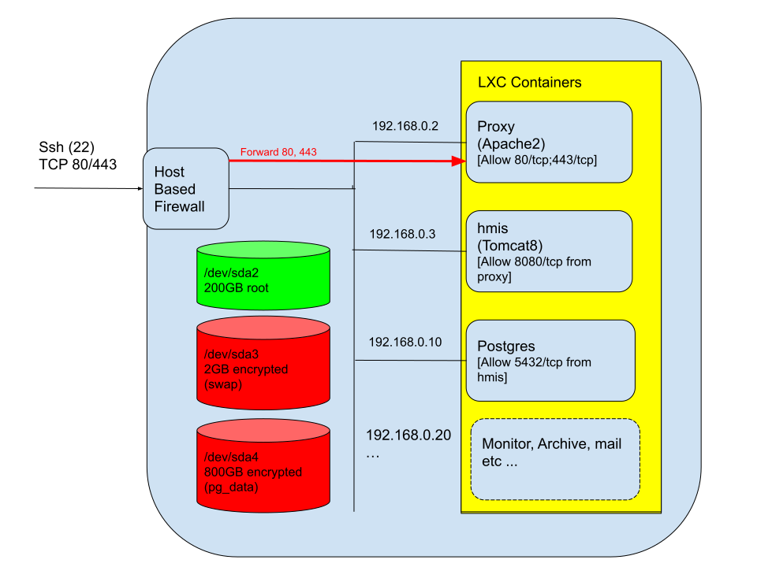

# DHIS2 backend architecture

## Components
A DHIS2 application requires a minimum of three components to run:
1.  A servlet container (usually tomcat, but others such as jetty are also used).  This is required to run the java DHIS2 web application and host additional apps.
2.  A database server.  Recent versions of DHIS2 require a postgresql database with version greater than 9.6.
3.  A web proxy frontend.  The primary function of this is for SSL termination and potentially load sharing.  nginx and apache2 are commonly used.

In production it is also necessary to include some form of monitoring solution as well as an alerting mechanism.  Popular solutions for m nitoring include munin and prometheus/grafana.  Prometheus is more modern and is likely to be directly integrated into dhis2 in the near future so might be a better long term option than munin.  A minimal alerting system can be implemented using a send-only mail system.  It is also possible to integrate the alerting into messaging systems such as Telegram or Slack.

It has been common practice to setup all three components on a single machine (or virtual machine). This might be called the "boombox" approach and should no longer be considered good practice except for very simple aggregate setups.  There are a number of good reasons to isolate these components:
1.  *Security*.  This is an important reason, particularly if you have a number of web applications running. If your web application gets hacked you want to be sure that the potential damage is limited.
2.  *Monitoring and performance*.  When all components are running together it can be hard to determine the underlying culprit in memory or cpu exhaustion and to provision each appropriately.
3.  *Scalability*.  In order to be able to scale the web application or database horizontally, replicas need to be allocated their own resources. 

Isolation can be done with different levels of granularity:
1.  Separate physical machines.  This provides isolation but is a bit of an inflexible (and expensive) solution to the problem.  The only exception to this might be the postgresql database server, where there can be some performance advantage to running on bare metal with direct access to disk array, but it is a costly choice.
2.  Separate virtual machines.  This can be a very sensible solution, where you dedicate an in-house VM or a cloud hosted VPS to each of the proxy, application server and database.  There is a security concern that might need to be taken into account as, by default, traffic will pass unencrypted on the network between the various components.  This might be considered OK if the network is trusted, but in many cases you might need to implement SSL on tomcat and postgres to ensure adequate encryption in transit.
3.  Separate containers.  This can be an elegant and lightweight solution to provide isolation between
components.  It is particularly attractive where you might be renting a single VPS server from a cloud provider.  There are different linux containerisation solutions with different advantages and  disadvantages. Most people will use docker or lxc or some combination of the two.  This guide will describe a solution using lxc, but we will also add documentation on docker.

Whichever of the different isolation approaches you adopt it is important to ensure that the components are configured with minimum access to one another.  So, for example, the tomcat containers need to be accessed via their http port from the proxy server. No more than that is required and so the host based firewall should restrict to that.  Similarly, containers should not normally be allowed to access one another by ssh.  Nor should the proxy container be able to access the postgresql server etc.  

## Reference example
The diagram below shows an example of a configuration using lxc containers.  It could be adapted to use different physical or virtual machines or docker containers.  In subsequent sections we will describe the setup of each component in geater detail.  Though we describe the installation step by step, automating the installation is advised to ensure consistency and rapid redeployment for disaster recovery.

Note that the host machine has a separate disk reserved for the postgresql data.  There are a number of reasons to do this.  In a high performance environment you would want to reserve your most expensive, most reliable and fastest disks (or disk array) for use by the database.  The primary motivation in this example is security.  We want to encrypt the disk to achieve encryption at rest.  It is also a good practice to encrypt the swap disk as there is a possibility unencrypted data will leak onto this.**